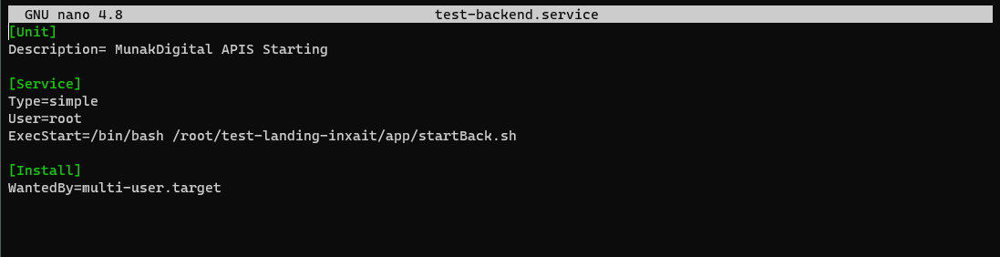
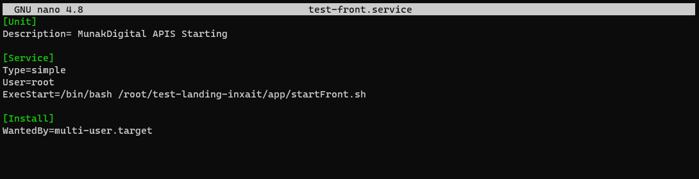

# Test landing inxait
Por Mauricio González

# Para ejecutar la prueba localmente

#  Laravel
- dentro de test-landing-inxait/app/back ejecutar composer install
- dentro de test-landing-inxait/app/back/database crear archivo database.sqlite
- dentro de test-landing-inxait/app/back php artisan migrate
- php artisan serve --port=85

# Angular
- dentro de test-landing-inxait/app/front ejecutar npm install
- dentro de test-landing-inxait/app/front/src/environments/environment.ts cambiar production a false
- ng s

# Para ejecutar la prueba en servidor

# Laravel
- dentro de test-landing-inxait/app/back ejecutar composer install
- dentro de test-landing-inxait/app/back/database crear archivo database.sqlite
- dentro de test-landing-inxait/app/back php artisan migrate
- crear demonio en /etc/systemd/system/start-back.service aputando al archivo startBack.sh

- systemctl start start-back.service

# Angular
- dentro de test-landing-inxait/app/front ejecutar npm install
- dentro de test-landing-inxait/app/front/src/environments/environment.ts dejar production en true
- dentro de test-landing-inxait/app/front ejecutar ng add @nguniversal/express-engine
- dentro de test-landing-inxait/app/front ejecutar npm run build:ssr
- crear demonio en /etc/systemd/system/start-front.service aputando al archivo startFront.sh

- systemctl start start-front.service
